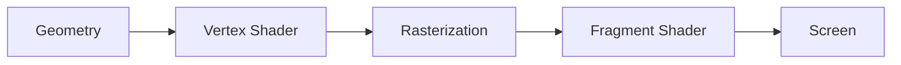
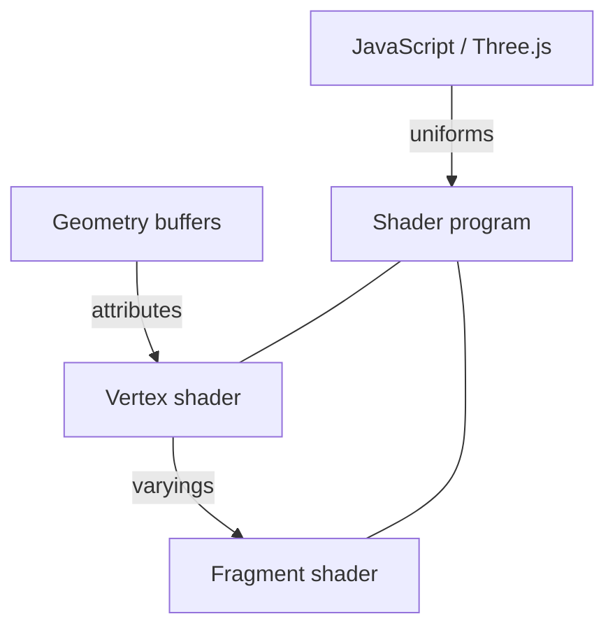

# Shader Fundamentals

A concise study note for understanding how shaders work in a React + Three.js project. Focus: the mental model and data flow — not specific effects.

---

## 1. What Is a Shader?

A **shader** is a small program that runs on the **GPU**.

Why that matters:

- The CPU is good at sequential logic (game state, UI, loading assets).
- The GPU is good at doing the **same simple math on huge numbers of items at once** — vertices, pixels, samples.
- Shaders are how you tell the GPU: *for every vertex / every fragment, compute this*.

**Parallel execution:** one vertex shader invocation per vertex; one fragment shader invocation per fragment (roughly “pixel of the triangle”). Millions of these can run together. That is why procedural terrain coloring, noise, and lighting are often done in shaders — the work scales with screen/mesh size, not with a single CPU loop.

**Mental model:** JavaScript sets up the scene; the shader is the per-vertex / per-pixel paintbrush on the GPU.

---

## 2. Shader Pipeline

Every frame, geometry travels through a fixed pipeline. At a beginner level:

**Geometry → Vertex Shader → Rasterization → Fragment Shader → Screen**



### Vertex shader

- Runs **once per vertex**.
- Main job: decide where that vertex ends up on screen (`gl_Position`).
- Can also pass data forward (normals, UVs, custom values) for later use.

Why it matters: mesh shape and camera projection live here. Changing vertex positions changes the silhouette of the object.

### Fragment shader

- Runs **once per fragment** (candidate pixel covered by a triangle).
- Main job: decide the **final color** of that fragment.
- Sees interpolated data from the three vertices of the triangle.

Why it matters: surface look — color, lighting response, procedural patterns — is decided here.

### Rasterization (brief)

Between the two shaders, the GPU fills the triangle: it figures out which pixels are covered and **interpolates** vertex outputs across that area. You do not write this step; you rely on it.

---

## 3. Data Flow: Vertex → Fragment

Data does not jump from “one vertex” to “one pixel.” It is blended across the triangle.

1. Vertex shader runs at each corner and outputs values (position + any extras you declare).
2. Rasterization interpolates those extras across the triangle’s interior.
3. Fragment shader receives the **interpolated** values for its pixel and computes color.

At a beginner GLSL level, those extras are often called **`varying`** (older GLSL / WebGL1 wording):

- You **write** them in the vertex shader (per vertex).
- You **read** them in the fragment shader (already interpolated).

```text
Vertex A ──┐
Vertex B ──┼── interpolate ──► Fragment (smooth blend of A/B/C)
Vertex C ──┘
```

Why it matters for procedural graphics: a value computed at vertices (height, slope hint, UV) becomes a smooth field over the surface when the fragment shader reads it. Dense meshes interpolate more accurately; sparse meshes show coarser blends.

> Note: Modern GLSL (WebGL2 / GLSL ES 3.00) uses `in` / `out` instead of the keyword `varying`. Same idea: vertex outputs → interpolated → fragment inputs.

---

## 4. GLSL Basics

**GLSL** (OpenGL Shading Language) is the language WebGL and Three.js use for shader programs. Three.js wraps WebGL; your `vertexShader` / `fragmentShader` strings are GLSL that the GPU compiles and runs.

### Types you will see constantly

| Type | Meaning | Typical use |
|------|---------|-------------|
| `float` | Single number | time, intensity, height |
| `vec2` | 2 floats | UV, screen xy |
| `vec3` | 3 floats | position, normal, RGB |
| `vec4` | 4 floats | clip-space position, RGBA |

```glsl
vec3 color = vec3(1.0, 0.5, 0.2);
float a = color.r;      // also .x — same channel
vec2 uv = vec2(0.0, 1.0);
```

### `void main()`

Every shader stage has an entry point named `main`. The GPU calls it for each vertex or fragment.

### Vertex: `gl_Position`

The vertex shader **must** write clip-space position to `gl_Position` (a `vec4`).

```glsl
void main() {
  gl_Position = projectionMatrix * modelViewMatrix * vec4(position, 1.0);
}
```

(In Three.js `ShaderMaterial`, matrices like `projectionMatrix` are often provided for you.)

### Fragment: color output

The fragment shader outputs the pixel color. In classic WebGL1 / Three.js default style:

```glsl
void main() {
  gl_FragColor = vec4(1.0, 0.0, 0.0, 1.0); // RGBA
}
```

In GLSL ES 3.00 you declare an `out vec4` instead of using `gl_FragColor`. Same role: **this fragment’s final color**.

---

## 5. Shader Inputs

Three input roles — different **who sets them** and **how often they change**:

| Kind | Set by | Frequency | Shared across? |
|------|--------|-----------|----------------|
| **uniform** | JavaScript (or Three.js) | Usually once per draw / per frame | All vertices & fragments of that draw |
| **attribute** | Geometry buffers | Per vertex | Only that vertex (then may become a varying) |
| **varying** | Vertex shader → GPU interpolate | Per fragment (interpolated) | Smooth across triangle |



**Why each matters:**

- **Uniforms** — global knobs: time, light position, color tint, noise seed. Ideal for animation and shared look.
- **Attributes** — mesh data: `position`, `normal`, `uv`. Different per vertex; define the shape and its baked data.
- **Varyings** — bridge from vertex → fragment so the fragment shader can use smooth surface data without re-fetching geometry.

Rule of thumb: *same for the whole object this frame?* → uniform. *Different per corner of the mesh?* → attribute. *Need it as a smooth field on the surface?* → pass as varying.

---

## 6. Core Spatial Data

These are the building blocks most later shader studies reuse. Know what they *are* and what they can *control visually*.

### `position`

Vertex location in **object (local) space** before transforms.

- Visually: where the mesh sits in its own coordinates; basis for height, distance-from-origin patterns, procedural offsets.

### `normal`

Direction the surface faces (unit vector), usually in object or world space depending on how you transform it.

- Visually: lighting response, facing vs grazing, slope relative to “up.”

### `uv`

2D coordinates typically in `[0, 1]` across the surface (from geometry or generated).

- Visually: texture placement, 2D noise domains, striping/grids mapped onto terrain or meshes.

### Local / object space

Coordinates relative to the mesh’s own origin and axes (before world transform).

- Visually: patterns locked to the model (move the object, the pattern moves with it).

### World space

Coordinates after the object is placed in the scene.

- Visually: patterns locked to the world (e.g. large-scale terrain noise that matches across tiles); height relative to global up.

### View direction

Direction from the surface point toward the camera (often computed in the fragment shader).

- Visually: view-dependent effects (edges, reflections, depth cues). Fundamentals only here — specific recipes come later.

### `time`

Almost always a **uniform** updated every frame from JavaScript (`clock.getElapsedTime()`, etc.).

- Visually: animation — scrolling noise, pulsing color, evolving procedural fields.

**Terrain / procedural hint:** heightfields and voxel meshes still become triangles with `position`, `normal`, and often `uv`. Shaders do not replace your density function; they shade the **mesh that came out of** that process — or sample similar math on the GPU using these spatial inputs.

---

## 7. Shaders in Three.js

How your React app reaches the GPU:

```text
React → React Three Fiber → Three.js → ShaderMaterial → GLSL → WebGL / GPU
```

- **React / R3F** — declare the scene and materials in components.
- **Three.js** — owns geometries, materials, cameras, and the WebGL renderer.
- **`ShaderMaterial`** — a material whose look is *your* vertex + fragment GLSL, plus uniforms you feed from JS.
- **WebGL / GPU** — compiles and runs those programs every frame.

### Minimal `ShaderMaterial` example

```js
const material = new THREE.ShaderMaterial({
  uniforms: {
    uTime: { value: 0 },
    uColor: { value: new THREE.Color('#4a7c59') },
  },
  vertexShader: /* glsl */ `
    varying vec2 vUv;

    void main() {
      vUv = uv;
      gl_Position = projectionMatrix * modelViewMatrix * vec4(position, 1.0);
    }
  `,
  fragmentShader: /* glsl */ `
    uniform float uTime;
    uniform vec3 uColor;
    varying vec2 vUv;

    void main() {
      float pulse = 0.5 + 0.5 * sin(uTime + vUv.x * 6.2831);
      gl_FragColor = vec4(uColor * pulse, 1.0);
    }
  `,
});

// each frame, from your render loop / R3F useFrame:
// material.uniforms.uTime.value = elapsedTime;
```

What to notice:

- **`uniforms`** — JS owns `uTime` / `uColor`; the fragment shader reads them.
- **`attribute`-like builtins** — `position`, `uv` come from the geometry (Three.js wires them in).
- **`varying vUv`** — vertex writes UV; fragment reads the interpolated UV.
- **`gl_Position` / `gl_FragColor`** — required outputs of each stage.

In React Three Fiber you typically attach this material to a mesh (`<shaderMaterial ... />` or a `useMemo`’d `ShaderMaterial`) and update uniforms in `useFrame`.

---

## Key Takeaways

- Shaders are **GPU programs**: vertex = where points go; fragment = what color each covered pixel becomes.
- Pipeline order is fixed: **geometry → vertex → rasterize (interpolate) → fragment → screen**.
- **Uniforms** = shared knobs from JS; **attributes** = per-vertex mesh data; **varyings** = interpolated bridge to the fragment shader.
- GLSL gives you `float` / `vec*` math, `main()`, `gl_Position`, and a fragment color out.
- Spatial inputs (`position`, `normal`, `uv`, spaces, view, time) are the vocabulary for later procedural and terrain shading — effects are recipes on top of this model.
- In this stack: **React → R3F → Three.js `ShaderMaterial` → GLSL → WebGL/GPU**.
